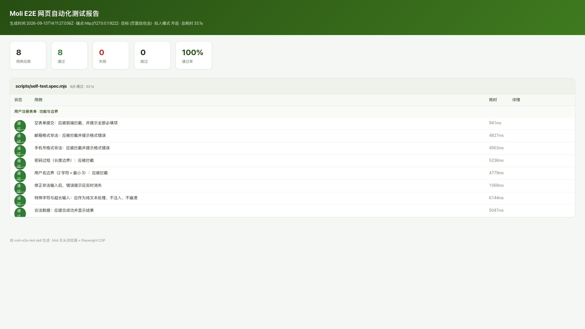

# 773MB → 73MB：我用 Moli 重做了网页 E2E 测试

人工点测有多烦，做前端的都懂：改一行代码，把所有表单再填一遍、把所有校验再试一遍。想上自动化，CI 小机器上 Chrome Headless 又动辄 700MB+，跑几个浏览器就 OOM。

最近换了 **Moli** —— 一个 Rust 写的无头浏览器，顺手封装成 4 个 Agent Skill。现在一条命令跑完全部功能与边界用例，出一份 HTML 报告。


## Moli 凭什么省内存

它不是 Chromium 的套壳，是自研引擎（嵌入 V8 + CSS 层叠 + 网络栈）。核心设计是**结构优先、按需渲染**：默认不布局不绘制，直接读运行时的 DOM 和样式状态；只有显式加 `--layout` 才真正排版和出图。

项目自测 192 个混合 URL 的中位内存：

| 引擎 | 中位 RSS |
| --- | --- |
| Moli | **73 MiB** |
| Chrome Headless | 773 MiB |

差一个数量级。2GB 的小 VPS 上 Chrome 会被 OOM killer 随机干掉，Moli 能稳稳跑完。

关键是：**它替代的是浏览器引擎，不是测试框架**。Playwright 照常用，只是把 Chromium 换成 Moli 的 CDP 端点。

## 四个 Skill 分工

| Skill | 干什么 |
| --- | --- |
| `moli-webfetch` | 抓网页：正文转 Markdown、JSON、截图、PDF |
| `moli-websearch` | 关键词/反向图片搜索，多引擎并行兜底 |
| `moli-cdp-server` | 起 CDP 服务，接 Playwright / Puppeteer |
| `moli-e2e-test` | **网页 E2E 测试**：拟人操作跑功能与边界用例，一键出报告 |

前三来自 Moli 官方仓库，最后一个是我自研的完整测试框架。

## macOS 上的安装

```bash
# 装二进制（Apple Silicon 原生包）
curl --proto '=https' --tlsv1.2 -fsSL \
  https://github.com/lexmount/moli/releases/latest/download/moli-installer.sh | sh

# 配 PATH（zsh）
echo 'export PATH="$PATH:$HOME/.local/bin"' >> ~/.zshrc && source ~/.zshrc

# 验证
moli --version   # moli 1.1.5
```

Skill 调用 Moli 有两种姿势：一次性任务走 `moli fetch`（跑完即退，无需服务）；要操作页面就 `moli serve --layout` 起个常驻 CDP 端点（`127.0.0.1:9222`），Playwright 直接 `connectOverCDP` 连上去——不启动第二个浏览器，也不需要 ChromeDriver。

## 一键跑测试

`moli-e2e-test` 把脏活都包了：解析 Node → 确保 Moli 服务在跑 → 按需装 Playwright（跳过浏览器下载）→ 跑用例 → 出报告 → 以退出码反映失败，可直接进 CI。

```bash
# 内置自检，不需要任何外部服务
bash scripts/run.sh

# 跑你自己的模块
bash scripts/run.sh ./e2e/crm.spec.mjs --base-url http://localhost:3000
```

用例里只写业务，操作是拟人的（逐字输入带抖动、鼠标移动到元素中心再点击）：

```js
session.it('必填客户名称为空：应被拦截', async (t) => {
  await t.human.goto('/crm/customer/create');
  await t.expect.blocked(() => t.human.click('button[type=submit]'));
  await t.expect.fieldError('.el-form-item:has(#name)', '请输入客户名称');
});
```

断言覆盖"被拦截"的完整语义：提交没跳转、字段报错出现了、且文案正确。



自检 8 条用例全绿，覆盖空表单拦截、邮箱/手机号格式、密码长度、用户名边界、修正后错误消失、特殊字符与超长输入、XSS 不注入，用时 33 秒。失败时会连控制台错误、失败请求和截图一起收进报告，定位很快。

## 两个坑

**一、零尺寸元素的包围盒**。Moli 对没有显式尺寸的元素（比如只含文本的 `div`）会返回 0×0 包围盒，Playwright 原生 `isVisible()` 会误判为不可见。这是引擎的布局特性，不是 bug。对策是把可见性判定改成基于计算样式和祖先链，别用裸 `isVisible()`。

**二、服务必须常驻**。短命 shell 里 `moli serve &` 会在命令返回后被回收，后续连接直接 502。用 `nohup` 或 launchd 挂住，`run.sh` 已经自动处理。

## 不建议用的场景

像素级视觉回归（软件光栅化，不等于 Chrome 像素）、WebGL、高保真 Canvas、媒体播放——这些还是交给真实 Chromium 做基线。

---

仓库（4 个 Skill + 完整测试框架 + 实测报告）已经开源：

**github.com/zcqshine/moli-skills**

克隆下来把 `skills/` 复制到你的 Agent skills 目录就能用。有在用 Moli 或者做 E2E 自动化的，欢迎交流。
